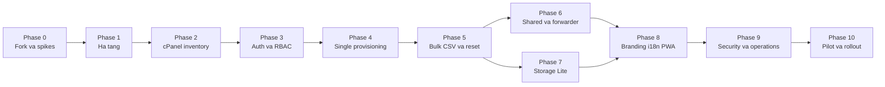

# Mailflow Internal cPanel - Roadmap trien khai

Trang thai: Da chot pham vi san pham. Phase 0 local hoan thanh ngay 2026-09-24;
san sang bat dau Phase 1.

## 1. Muc tieu

Fork Mailflow thanh mot ung dung mail noi bo cho mot to chuc, ket noi mot tai
khoan cPanel va mot domain. Ung dung giu trai nghiem mail client cua Mailflow,
dong thoi bo sung quan ly mailbox cho nguoi dung no-code:

- Dong bo mailbox dang co tren cPanel.
- Tao mailbox theo single, bulk va CSV.
- Quan ly quota, reset mat khau, suspend va xoa co thoi gian cho.
- Ho tro mailbox dung chung va forwarder noi bo.
- Phan quyen Owner, Mod va Member.
- Cho phep Mod duoc cap quyen thay logo, ten va mau thuong hieu cua PWA.
- Van hanh tren VPS rieng, trong khi cPanel van la nguon du lieu mail chinh.

## 2. Cac quyet dinh da khoa

### San pham va pham vi

- Mot to chuc, mot tai khoan cPanel, mot domain; khong multi-tenant.
- Gioi han goi cPanel hien tai: 15 mailbox, toi da 10 GB/mailbox.
- Mot mailbox he thong `mailflow@domain` gui activation va notification, nen con
  toi da 14 mailbox ca nhan/dung chung neu khong dung SMTP ngoai.
- Web responsive va PWA la nen tang MVP; chua phat hanh native app.
- Tieng Viet mac dinh, tieng Anh tuy chon.
- cPanel la source of truth cho mailbox, quota va trang thai server.

### Dang nhap va phan quyen

- Member dang nhap bang dia chi email va mat khau mailbox.
- Owner va Mod bat buoc 2FA.
- Khong mo public registration.
- Owner quan ly cPanel connector, role, quyen Mod va xoa vinh vien.
- Mod co the tao, sua quota, suspend va phat hanh cac workflow reset duoc phep;
  Mod khong co quyen doc mailbox ca nhan cua nguoi khac.
- Quyen `manage_branding` duoc Owner cap rieng cho tung Mod.
- Khong co Emergency Owner. Khi cPanel/IMAP loi, he thong co the chuyen sang
  trang bao tri va cho provider khoi phuc dich vu.

### Du lieu va ha tang

- App chay tren VPS bang Docker Compose voi Node.js, PostgreSQL va Redis.
- `inbox.domain.com` di qua Cloudflare proxy tren HTTPS 443.
- Hostname MX/IMAP/SMTP/autodiscover de DNS-only.
- Backend goi truc tiep `mail49.vietnix.vn:2083` bang cPanel API token.
- VPS luu metadata, cau hinh, role va audit log.
- Noi dung mail dung che do cache tiet kiem: toi da 2 GB hoac 7 ngay.
- Attachment tai truc tiep tu cPanel qua IMAP va khong luu lau dai tren VPS.
- Backup database, cau hinh va encryption key hang ngay; giu 7 ban ngay va 4
  ban tuan.

### Giay phep va upstream

- Ban fork tuan thu AGPL-3.0.
- Nguoi dung noi bo co the lay source tu trang About sau khi dang nhap.
- Giu module cPanel, auth, branding va storage policy tach biet de giam xung dot
  khi merge upstream.
- Kiem tra upstream hang thang; nang cap thong thuong theo quy, security fix
  nghiem trong sau khi test staging.

## 3. Chien luoc phat hanh

| Moc | Phase | Ket qua | Uoc luong mot full-stack engineer |
| --- | --- | --- | --- |
| Foundation | 0-2 | Fork chay on dinh, ha tang san sang, doc duoc inventory cPanel | 2.5-3 tuan |
| Internal Alpha | 3-5 | Dang nhap, RBAC, tao va quan ly mailbox day du | 4-5 tuan |
| Internal Beta | 6-8 | Shared mailbox, cache tiet kiem, branding va PWA tieng Viet | 3.5-4.5 tuan |
| Production | 9-10 | Hardening, restore drill, pilot va rollout | 2-3 tuan |

Tong uoc luong: 12-15.5 tuan cho mot engineer co kinh nghiem, khong tinh thoi
gian cho DNS, provider hoac review cua nguoi dung. Uoc luong la khoang lap ke
hoach, khong phai cam ket lich.

## 4. Roadmap theo phase

### Phase 0 - Fork baseline va technical spikes

Muc tieu: co mot baseline Mailflow khong sua doi va giai quyet som bon rui ro
kien truc lon nhat.

Pham vi:

- Fork upstream, cau hinh `origin` va `upstream`, giu nguyen license/notice.
- Pin mot upstream tag/commit lam baseline; khong dung image `latest`.
- Build va chay nguyen ban frontend, backend, PostgreSQL va Redis.
- Ghi baseline test, migration va deployment de so sanh sau moi phase.
- Spike auth provider xac thuc Member bang IMAP ma khong viet lai toan bo auth.
- Spike RBAC thay cho `is_admin` boolean hien tai.
- Spike data model many-to-many cho shared mailbox.
- Spike dynamic manifest/icon cho PWA branding.
- Chot convention migration rieng cua fork de tranh trung ten migration upstream.

Deliverables:

- Fork co the build va chay local/staging.
- ADR ngan cho auth, RBAC, cPanel adapter, shared mailbox va storage cache.
- Test harness co mock/fixture cho IMAP, SMTP va cPanel UAPI.
- Bang liet ke cac patch cham vao core Mailflow de theo doi xung dot upstream.

Gate hoan thanh:

- Baseline login, connect IMAP, doc va gui mail van hoat dong.
- Bon spike tren co ket luan kha thi va khong con blocker kien truc.
- Co rollback ve upstream baseline ma khong mat database.

### Phase 1 - Ha tang, staging va domain

Muc tieu: co moi truong staging gan production, duoc truy cap an toan qua domain
that.

Pham vi:

- Docker Compose cho frontend, backend, PostgreSQL va Redis.
- Tach staging/production secrets; tao `SESSION_SECRET`, `ENCRYPTION_KEY` va
  database credentials rieng.
- Reverse proxy, HTTPS, WebSocket va health endpoint.
- Cloudflare: proxy hostname app; mail/MX/IMAP/SMTP de DNS-only.
- Cloudflare SSL mode `Full (strict)`; bypass cache cho API, auth va activation.
- Hien thi app version, upstream commit va schema version trong diagnostics.
- Viet tai lieu domain/Cloudflare/HTTPS va checklist xac minh.

Deliverables:

- Staging truy cap duoc qua HTTPS va WebSocket.
- `DOMAIN-CLOUDFLARE-SETUP.md` va `DEPLOYMENT.md`.
- Health check khong de lo secret hoac thong tin mailbox.

Gate hoan thanh:

- PWA tai duoc tren desktop va mobile.
- IMAP 993, SMTP 465/587 va cPanel 2083 van truy cap truc tiep sau khi bat
  Cloudflare cho app.
- Restart container khong lam mat database hoac secret.

### Phase 2 - cPanel connector va inventory read-only

Muc tieu: ket noi cPanel an toan va dong bo danh sach mailbox ma chua thuc hien
thao tac thay doi server.

Pham vi:

- Owner-only setup cho host, port 2083, cPanel username va API token.
- Ma hoa token tai backend; khong gui token da luu tro lai browser.
- Nut Test Connection voi thong bao loi than thien.
- Adapter cPanel UAPI voi timeout, retry gioi han va error normalization.
- Doc `Email/list_pops_with_disk` va client settings tu cPanel.
- Dong bo dia chi, quota, disk usage, restrictions va trang thai mailbox.
- cPanel la source of truth; thay doi ngoai app duoc phat hien khi refresh/sync.
- Hien thi suc chua `da dung / 15`, danh dau mailbox he thong.
- Audit lan test token, thay token va sync; khong log token.

Deliverables:

- Trang cPanel Connection va Mailbox Inventory.
- Background sync idempotent va nut Refresh thu cong.
- Mock contract tests cho payload thanh cong, loi quyen, timeout va malformed
  response.

Gate hoan thanh:

- Liet ke dung mailbox/quota tren tai khoan cPanel that.
- Sync lap lai khong tao ban ghi trung.
- Token sai/het han khong anh huong viec nguoi dung tiep tuc dung IMAP/SMTP.

### Phase 3 - Identity, IMAP auth va RBAC

Muc tieu: tach ro app user, cPanel mailbox va role trong ung dung.

Pham vi:

- Role `Owner`, `Mod`, `Member` va permission middleware chi tiet.
- Permission toi thieu: manage mailboxes, reset, suspend, shared access,
  forwarder, branding, audit, cPanel settings va permanent delete.
- Member dang nhap bang full email + mailbox password; xac thuc qua IMAP.
- Luu mailbox credential bang AES-256-GCM de background sync hoat dong.
- Owner/Mod bat buoc TOTP va recovery codes; step-up 2FA cho action nhay cam.
- Tat public registration; chi invite mailbox da ton tai hoac provisioning moi.
- Import mailbox cu: invite, validate mat khau IMAP, tao app user va link account.
- Khi mat khau bi doi ngoai app, hien thi reconnect thay vi khoa tai khoan.
- Owner quan ly role; Mod khong the tu nang quyen hoac thay cPanel connector.
- Trang bao tri khi cPanel/IMAP khong kha dung va login moi khong the xac thuc.

Deliverables:

- Auth provider tach khoi route auth goc.
- Permission matrix co test deny/allow cho moi role.
- Luong invite mailbox cu va reconnect credential.

Gate hoan thanh:

- Member chi truy cap mailbox cua minh va shared mailbox duoc gan.
- Mod khong the doc mailbox ca nhan cua nguoi khac qua API/UI.
- Tat ca action Owner/Mod nhay cam yeu cau 2FA hop le.
- Khong con route nao chi dua vao `is_admin` cho quyen moi.

### Phase 4 - Single provisioning va mailbox lifecycle

Muc tieu: Mod tao va quan ly mot mailbox an toan tu dau den cuoi.

Pham vi:

- Loai mailbox: ca nhan, dung chung, he thong.
- Ten goi y `ten.ho`, bo dau tieng Viet, xu ly collision va cho Mod xac nhan.
- Tao mailbox qua endpoint cPanel phu hop; uu tien flow tuong thich password
  reset, co fallback duoc adapter bao boc.
- Template quota Standard 2 GB, Large 5 GB va Custom toi da 10 GB.
- Kiem tra gioi han 15 mailbox truoc khi tao.
- State machine:
  `creating -> pending_activation -> active -> suspended -> pending_delete -> deleted`.
- Trang thai `needs_attention` va retry idempotent khi workflow loi mot phan.
- Activation token mot lan, het han 24 gio; token moi vo hieu token cu.
- Personal mailbox tao app user pending; shared/system khong tao login rieng.
- Suspend login/outgoing; mac dinh van nhan mail trong thoi gian offboarding.
- Xoa mem 30 ngay; chi Owner xoa vinh vien sau 2FA va nhap lai dia chi.
- Khong auto-delete sau 30 ngay. Canh bao cPanel co the xoa maildir.

Deliverables:

- Wizard tao mailbox single.
- Trang chi tiet mailbox va timeline lifecycle.
- Job danh dau tai khoan den han review/xoa, khong tu purge.

Gate hoan thanh:

- Retry khong tao mailbox/app user trung.
- Loi app sau khi cPanel tao thanh cong duoc sua bang Retry, khong auto-delete.
- Quota, suspend va deletion state dong bo lai dung tu cPanel.

### Phase 5 - Bulk, CSV, activation va reset

Muc tieu: provisioning nhieu tai khoan van an toan cho nguoi dung no-code.

Pham vi:

- Ba mode: Single, Bulk form va CSV upload.
- CSV template gom ten, local-part, loai mailbox, quota, recovery email va role.
- Preview/Validate truoc khi goi cPanel.
- Chuan hoa ten, email, quota; danh dau duplicate va dong sai dinh dang.
- Neu vuot suc chua, yeu cau Mod chon dung so dong con trong.
- Tao cac dong hop le; bao cao thanh cong/that bai cho tung dong.
- Khong reset hoac ghi de mailbox dang ton tai.
- Copy, Web Share va export CSV chua email + activation link + expiry + status.
- Khong xuat plaintext password.
- Reset mailbox active:
  - Co recovery email: gui link truc tiep, Mod khong thay URL.
  - Khong co recovery email: Mod tao request, Owner approve truoc khi share.
  - Reset thanh cong logout session cu va cap nhat encrypted credential.

Deliverables:

- Bulk editor, CSV importer, result report va file template.
- Activation/reset service dung chung voi token hashing, expiry va revocation.
- Audit cho upload, export, activation, reset request va approval.

Gate hoan thanh:

- Batch loi mot phan khong anh huong dong da thanh cong.
- Tai lai trang van xem duoc ket qua batch ma khong lam lo activation token da
  het hieu luc.
- Mod khong the dung reset flow de chiem mailbox active ma bo qua Owner/recovery.

### Phase 6 - Shared mailbox va forwarder noi bo

Muc tieu: nhieu Member cung xu ly hop thu chung ma khong chia se mat khau.

Pham vi:

- Many-to-many giua app user va shared mailbox.
- Hai muc quyen: `Read` va `Read & Send`.
- Credential shared mailbox chi backend biet; UI khong reveal.
- Gui bang dia chi chung nhung audit ghi user thuc hien.
- Owner/Mod them, go thanh vien; xu ly session khi quyen bi thu hoi.
- Forwarder mot dia chi den mot hoac nhieu mailbox noi bo.
- Validate loop, duplicate destination va dia chi ngoai domain.
- Khong ho tro external forwarding hoac catch-all trong MVP.

Deliverables:

- Shared access management va sender picker.
- Internal forwarder CRUD qua cPanel adapter.
- Audit read-access assignment, send actor va forwarder changes.

Gate hoan thanh:

- Go quyen mot Member khong anh huong thanh vien khac va co hieu luc ngay.
- Member Read khong the gui bang shared address.
- Forwarder loop bi chan truoc khi goi cPanel.

### Phase 7 - Storage Lite va cache budget

Muc tieu: giu VPS nhe trong khi mail goc van nam tren cPanel.

Pham vi:

- Luon luu metadata can thiet cho folder, thread, sender, subject va unread.
- Body tai theo nhu cau tu IMAP; attachment stream truc tiep, khong persist.
- Them `cached_at`, `last_accessed_at` va byte estimate cho body cache.
- Eviction LRU khi qua 2 GB hoac body cu hon 7 ngay.
- Settings cho Owner chon 1/2/5/10 GB va TTL phu hop.
- Dashboard dung luong, cache hit rate, lan cleanup cuoi va nut Don cache.
- Search metadata cho toan bo history; full-text body chi ap dung voi noi dung
  dang duoc cache.
- Khi mailbox bi xoa vinh vien, xoa metadata/body cache lien quan.

Deliverables:

- Cache policy service, scheduled cleanup va storage dashboard.
- Migration/backfill an toan cho database hien co.
- Test dam bao eviction khong xoa mail tren IMAP/cPanel.

Gate hoan thanh:

- Database body cache khong vuot budget ngoai sai so giao dich nho.
- Don cache khong lam mat folder, unread, subject hoac server mail.
- Khi cPanel bao tri, UI phan biet body da cache va body chua the tai.

### Phase 8 - Dynamic branding, i18n va PWA polish

Muc tieu: Mod duoc cap quyen co the doi thuong hieu ma khong rebuild app.

Pham vi:

- Permission `manage_branding`; Owner cap cho tung Mod.
- App name toi da 40 ky tu va PWA short name de xuat toi da 12 ky tu.
- Upload PNG/JPEG/WebP, toi thieu 512x512, toi da 2 MB; khong upload SVG.
- Crop square, generate icon 72-512, favicon va maskable icon.
- Dynamic manifest, browser title, login/sidebar logo, theme color va push title.
- Versioned asset URL/ETag de lam moi service-worker/browser cache.
- Preview desktop/mobile/PWA, restore default va rollback branding truoc.
- Audit old/new values va actor.
- Tieng Viet mac dinh; error mapping tu IMAP/cPanel sang huong dan de hieu.
- About giu dong `Based on MailFlow`, AGPL va internal Source Code link.
- Huong dan iOS co the can xoa/cai lai PWA de nhan icon/name moi.

Deliverables:

- Branding settings, upload pipeline va dynamic public branding endpoint.
- Vietnamese locale day du cho cac flow MVP.
- PWA install/update guide.

Gate hoan thanh:

- Branding moi hien dung tren login, sidebar, tab, manifest va notification.
- Mod khong co `manage_branding` bi tu choi o ca UI va API.
- File gia, qua lon, sai kich thuoc va payload nguy hiem bi chan.

### Phase 9 - Security, audit, backup va upstream operations

Muc tieu: dua he thong tu beta thanh production-ready.

Pham vi:

- Audit retention 12 thang cho provisioning, reset, role, token, branding,
  export, suspend, delete va shared access.
- Rate limiting cho login, activation, reset, CSV va cPanel mutations.
- CSRF/session hardening, secure cookie, CSP va upload validation.
- Chan SSRF va private/non-standard mail host ngoai connection policy da duyet.
- cPanel token rieng `mailflow-production`, rotation 180 ngay neu provider ho tro;
  nhac truoc 30/14/7 ngay.
- Backup ma hoa hang ngay cho PostgreSQL, config va `ENCRYPTION_KEY`.
- Restore drill; RPO 24 gio, RTO 4 gio.
- External health monitoring moi phut; alert qua kenh ngoai he thong mail.
- Staging upgrade runbook, upstream merge checklist va production rollback.
- Tao source archive tuong ung moi production release.
- Resource/load test voi 15 mailbox va concurrent sync.

Deliverables:

- Security checklist, threat model va audit queries.
- Backup/restore scripts va bang chung restore drill.
- Operations runbook, upstream update runbook va incident checklist.

Gate hoan thanh:

- Restore staging tu backup thanh cong va giai ma duoc mailbox credential.
- Khong co secret trong log, browser response, export hoac source archive.
- Security test xac nhan role/permission khong the bi bypass qua API.

### Phase 10 - Pilot, UAT va rollout

Muc tieu: xac minh workflow that voi nhom nho truoc khi mo cho ca to chuc.

Pham vi:

- Pilot mot Owner, mot Mod va hai Member trong khoang mot tuan.
- Dong bo metadata moi nhat truoc; 90 ngay gan nhat dung duoc som, history cu
  tiep tuc backfill o background.
- Test web, mobile PWA, Roundcube, Outlook/Apple Mail va password reconnect.
- Thu single/bulk/CSV, shared mailbox, forwarder, reset va offboarding.
- Theo doi IMAP connection, sync latency, cache size, cPanel errors va feedback.
- Sua blocker; rollout theo dot nho thay vi moi tat ca cung luc.

Production acceptance:

- Ket noi va dong bo mailbox cu chinh xac.
- Single, Bulk va CSV khong tao duplicate.
- Activation/reset dung permission va khong lo password/token.
- Member gui/nhan duoc trong Mailflow va mail client ngoai.
- Shared mailbox va forwarder noi bo hoat dong, audit du actor.
- Quota, suspend va delete 30 ngay dong bo dung voi cPanel.
- Branding cap nhat UI, manifest va push notification.
- Cache ton trong TTL va budget.
- Backup da restore thu thanh cong.
- Tai lieu domain, Cloudflare, deployment va operations du cho nguoi van hanh.

Gate hoan thanh:

- Pilot sign-off khong con blocker nghiem trong.
- Co rollback image/database migration cho production release.
- Tat ca acceptance item co bang chung test hoac UAT.

## 5. cPanel UAPI contract du kien

Adapter cPanel phai bao boc endpoint va payload, de UI/workflow khong phu thuoc
truc tiep vao ten ham UAPI. Capability probe tren staging quyet dinh endpoint
thuc te duoc phep boi goi hosting.

| Nghiep vu | UAPI/flow du kien | Luu y |
| --- | --- | --- |
| List mailbox | `Email/list_pops_with_disk` | Lay them restrictions, quota va disk usage |
| Client settings | `Email/get_client_settings` | Khong hardcode IMAP/SMTP hostname/port |
| Create mailbox | `UserManager/create_user` uu tien; `Email/add_pop` fallback | `add_pop` co the khong tuong thich reset-password flow |
| Change password | `Email/passwd_pop` hoac UserManager flow da probe | API khong the doc lai mat khau hien tai |
| Change quota | `Email/edit_pop_quota` | Khong vuot package/mailbox maximum |
| Suspend login | `Email/suspend_login` / unsuspend | Van co the tiep tuc nhan mail |
| Suspend incoming/outgoing | Cac ham suspend/unsuspend tuong ung | Dung preset ro rang cho offboarding/compromise |
| Delete mailbox | `Email/delete_pop` | Mac dinh co the xoa maildir; chi Owner thuc hien |
| Forwarder | Add/list/delete forwarder functions cua `Email` | Chi destination noi bo, validate loop truoc API call |

Tat ca mutation phai co idempotency key o workflow layer, timeout, normalized
error, audit event va sync lai inventory sau khi thanh cong.

## 6. Cac hang muc khong thuoc MVP

- Tu dong sua DNS, MX, DKIM, SPF hoac DMARC.
- Server-side spam quarantine management; van giu tinh nang spam hien co cua
  Mailflow.
- Calendar/CalDAV; van giu contacts/CardDAV hien co cua Mailflow.
- External forwarding, catch-all va domain forwarding.
- WHM, reseller, nhieu cPanel account hoac multi-tenant.
- Billing, subscription va self-service tenant onboarding.
- Native Electron/App Store/Google Play release.
- Doi ten mailbox va tu dong migrate mail sang mailbox moi.

## 7. Rui ro chinh va bien phap

| Rui ro | Tac dong | Bien phap trong roadmap |
| --- | --- | --- |
| IMAP auth khac auth goc Mailflow | Xung dot upstream, loi session | Spike Phase 0, auth provider tach biet, contract tests |
| Mod reset mat khau co the chiem mailbox | Vi pham quyen rieng tu | Recovery direct-send va Owner approval o Phase 5 |
| Shared mailbox khong hop data model 1-user/1-account | Lo du lieu hoac duplicate sync | Many-to-many spike Phase 0, permission tests Phase 6 |
| cPanel API token co quyen rong | Anh huong toan bo mailbox | Owner-only, encryption, rotation va audit |
| cPanel API/provider khac tai lieu | Workflow provisioning loi mot phan | Adapter, capability probe, idempotent retry |
| Database body cache tang vo han | VPS het dung luong | Hard budget, TTL va LRU Phase 7 |
| Dynamic PWA icon bi cache | Branding khong cap nhat | Versioned assets, ETag va iOS reinstall guide |
| Merge upstream gay migration conflict | Production upgrade that bai | Migration namespace, staging va rollback runbook |
| Xoa mailbox lam mat maildir | Mat du lieu vinh vien | 30-day hold, Owner + 2FA, manual delete, backup warning |

## 8. Quy tac thuc thi moi phase

Moi phase chi dong khi dap ung day du:

1. Deliverables da nam trong source va tai lieu.
2. Acceptance/gate duoc test bang evidence phu hop.
3. Migration co duong rollback hoac restore da duoc mo ta.
4. Khong ghi secret/password/token vao log hay test fixture that.
5. Permission moi co ca allow tests va deny tests.
6. Staging chay on dinh truoc khi merge/deploy production.
7. Roadmap va changelog duoc cap nhat neu scope thay doi.

Security, authorization, secret handling va audit duoc lam cung tung phase;
Phase 9 la hardening/convergence gate, khong phai luc moi bat dau xu ly bao mat.

## 9. Dau vao can co khi bat dau Phase 0-1

- Domain thuc te va quyen quan ly Cloudflare DNS.
- Cau hinh VPS: OS, vCPU, RAM, disk trong va cac workload dang chay.
- Quyen tao staging hostname va TLS certificate.
- cPanel username va API token chi nhap truc tiep trong setup/staging, khong gui
  qua chat hoac commit vao repository.
- Mot mailbox test rieng va recovery email de test activation/reset.
- Kenh alert ngoai he thong, vi du Telegram hoac email ngoai domain.

## 10. Definition of Done cho buoc roadmap

Roadmap nay duoc xem la san sang de thuc thi khi:

- Tat ca quyet dinh cua phien grilling da duoc anh xa vao phase hoac non-goal.
- Moi phase co muc tieu, pham vi, deliverables va gate hoan thanh.
- Phu thuoc va rui ro lon duoc xu ly truoc phase bi anh huong.
- MVP co mot production acceptance gate ro rang.
- Cac dau vao van hanh con thieu duoc liet ke rieng, khong bi ngam hieu.
